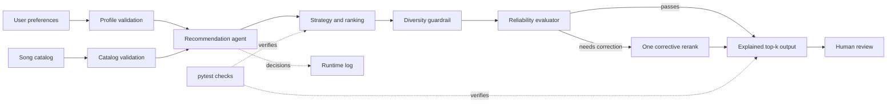

# VibeMatch 2.0: Adaptive and Reliable Music Recommender

VibeMatch 2.0 is an explainable, content-based music recommendation system that ranks songs from a local catalog using a listener's genre, mood, energy, acoustic, and optional musical-feature preferences. It extends a transparent scoring model with a bounded agentic workflow that validates inputs, selects a scoring strategy, applies diversity guardrails, evaluates recommendation quality, and performs one corrective rerank when the first result underrepresents the user's stated priority.

This project matters because recommendation quality is not only about producing a ranked list. A useful system should also detect weak results, explain why items were selected, handle invalid data safely, and make its corrective behavior visible to users and developers.

## Original Project from Modules 1–3

The original project was **Music Recommender Simulation**, also named **VibeMatch 1.0**, completed across Modules 1–3. It introduced a deterministic content-based recommender that represented songs and user preferences as structured data, scored each song using genre, mood, energy similarity, and acoustic preference, and returned an explained top-k ranking. The project also evaluated the system across several listener profiles and documented its limitations as a classroom simulation.

Original repository: [Music Recommender Simulation](https://github.com/1aur/ai110-module3show-musicrecommendersimulation-starter)

VibeMatch 2.0 preserves the original balanced scoring recipe while turning it into a larger applied AI system with validation, strategy selection, reliability evaluation, bounded self-correction, diversity controls, logging, and a reusable command-line interface.

## Core Capabilities

- Generates top-k music recommendations from a CSV catalog.
- Supports built-in evaluation profiles and custom listener preferences.
- Preserves the original VibeMatch 1.0 scoring behavior through the `balanced` strategy.
- Offers `genre_first`, `mood_first`, `energy_focused`, and `discovery` strategies.
- Evaluates each ranking for priority alignment, energy alignment, diversity, score strength, catalog support, and explanation completeness.
- Performs at most one corrective rerank when the first result fails a reliability threshold.
- Limits repeated artists and genres through a diversity guardrail.
- Explains every recommendation using the factors that contributed to its score.
- Validates user profiles and catalog rows before recommendation begins.
- Records system decisions and failures in `logs/vibematch.log`.

## Architecture Overview

The system begins with two inputs: listener preferences from the command line and song metadata from `data/songs.csv`. Validation modules normalize both inputs or return a readable error before unsafe data reaches the recommendation workflow.

The `RecommendationAgent` then selects an initial scoring strategy and asks the recommender to score and rank a candidate pool. A diversity guardrail adjusts repeated artists or genres, and the reliability evaluator measures the resulting list. Strong results are returned immediately. Weak results trigger one corrective strategy selected from the user's priority, after which the final recommendations, explanations, quality summary, guardrail actions, and logs are presented for human review.



The complete editable Mermaid source is available at [`diagrams/vibematch-system-architecture.mmd`](diagrams/vibematch-system-architecture.mmd).

## Project Structure

```text
vibematch-applied-ai-system/
├── data/
│   └── songs.csv
├── diagrams/
│   └── vibematch-system-architecture.mmd
├── evaluation/
│   ├── reproducible-output.txt
│   ├── results.json
│   ├── results.md
│   └── run_evaluation.py
├── logs/
│   └── .gitkeep
├── src/
│   ├── agent.py
│   ├── diversity.py
│   ├── evaluator.py
│   ├── logging_config.py
│   ├── main.py
│   ├── recommender.py
│   ├── strategies.py
│   └── validation.py
├── tests/
│   ├── test_agent.py
│   ├── test_catalog_loading.py
│   ├── test_cli.py
│   ├── test_diversity.py
│   ├── test_evaluator.py
│   ├── test_recommender.py
│   └── test_validation.py
├── model_card.md
├── pytest.ini
├── requirements.txt
└── README.md
```

## Setup Instructions

### Prerequisites

- Python 3.11 or newer
- Git

No external API key or paid AI service is required. The recommendation and reliability workflow runs locally and deterministically.

### 1. Clone the repository

```bash
git clone https://github.com/1aur/vibematch-applied-ai-system.git
cd vibematch-applied-ai-system
```

### 2. Create a virtual environment

macOS or Linux:

```bash
python3 -m venv .venv
source .venv/bin/activate
```

Windows PowerShell:

```powershell
py -m venv .venv
.venv\Scripts\Activate.ps1
```

### 3. Install dependencies

```bash
python -m pip install --upgrade pip
python -m pip install -r requirements.txt
```

### 4. Run the built-in profiles

```bash
python -m src.main --profile all
```

Available built-in profiles:

```text
high-energy-pop
chill-lofi
deep-intense-rock
conflicting-sad-workout
```

Run one profile:

```bash
python -m src.main --profile conflicting-sad-workout
```

### 5. Run a custom profile

A custom profile requires genre, mood, energy, and either `--acoustic` or `--non-acoustic`.

```bash
python -m src.main \
  --genre jazz \
  --mood chill \
  --energy 0.45 \
  --acoustic \
  --priority discovery \
  --top-k 3
```

Optional controls include:

- `--priority balanced|genre|mood|energy|discovery`
- `--strategy auto|balanced|genre_first|mood_first|energy_focused|discovery`
- `--target-valence VALUE`
- `--target-danceability VALUE`
- `--target-tempo-bpm VALUE`
- `--top-k NUMBER`
- `--catalog PATH`
- `--lenient-catalog` to skip invalid CSV rows instead of stopping

### 6. Run the tests

```bash
pytest
```

### 7. Run the reproducible reliability benchmark

```bash
python -m evaluation.run_evaluation
```

The command evaluates six recommendation scenarios plus four validation and reliability checks. It regenerates the machine-readable [`evaluation/results.json`](evaluation/results.json), the reviewer-friendly [`evaluation/results.md`](evaluation/results.md), and the captured command summary in [`evaluation/reproducible-output.txt`](evaluation/reproducible-output.txt).

### 8. Review runtime logs

```bash
tail -n 20 logs/vibematch.log
```

The generated `.log` file is excluded from Git, while `logs/.gitkeep` preserves the directory.

## Sample Interactions

The following examples are abridged from actual runs against the included 18-song catalog. Timestamps and routine log lines are omitted for readability.

### Example 1: Strong ranking passes without correction

**Input**

```bash
python -m src.main --profile high-energy-pop
```

**Output**

```text
User profile: high-energy-pop
Initial strategy: balanced
Final strategy: balanced
Corrective retry: no
Quality score: 0.90 -> 0.90
Reliability warnings: none

1. Sunrise City by Neon Echo
   Score: 4.48
   Reasons: genre match (+2.00), mood match (+1.00), energy similarity (+0.98), acoustic preference match (+0.50)

2. Gym Hero by Max Pulse
   Score: 3.37
   Reasons: genre match (+2.00), energy similarity (+0.87), acoustic preference match (+0.50)

3. Rooftop Lights by Indigo Parade
   Score: 2.46
   Reasons: mood match (+1.00), energy similarity (+0.96), acoustic preference match (+0.50)
```

The evaluator accepts the initial ranking because its energy alignment and overall quality are above threshold.

### Example 2: Agent detects a weak priority match and reranks

**Input**

```bash
python -m src.main --profile conflicting-sad-workout
```

**Output**

```text
User profile: conflicting-sad-workout
Initial strategy: balanced
Final strategy: mood_first
Corrective retry: yes
Quality score: 0.71 -> 0.90
Reliability warnings: none

1. Blue Sunday by The Harbor Choir
   Score: 4.05
   Reasons: mood match (+2.50), energy similarity (+0.56), valence similarity (+0.99)

2. Gym Hero by Max Pulse
   Score: 3.00
   Reasons: genre match (+1.00), energy similarity (+0.97), acoustic preference match (+0.50), valence similarity (+0.53)

3. Sunrise City by Neon Echo
   Score: 2.88
   Reasons: genre match (+1.00), energy similarity (+0.92), acoustic preference match (+0.50), valence similarity (+0.46)
```

The original balanced ranking placed high-energy pop songs above the requested melancholic mood. Because mood was explicitly marked as the user's priority, the evaluator requested one corrective retry and the agent switched to `mood_first`, moving the strongest melancholic match to first place.

### Example 3: Custom acoustic profile

**Input**

```bash
python -m src.main \
  --genre jazz \
  --mood chill \
  --energy 0.45 \
  --acoustic \
  --priority discovery \
  --top-k 3
```

**Output**

```text
User profile: custom
Initial strategy: balanced
Final strategy: balanced
Corrective retry: no
Quality score: 0.85 -> 0.85
Reliability warnings: none

1. Coffee Shop Stories by Slow Stereo
   Score: 3.42
   Reasons: genre match (+2.00), energy similarity (+0.92), acoustic preference match (+0.50)

2. Midnight Coding by LoRoom
   Score: 2.47
   Reasons: mood match (+1.00), energy similarity (+0.97), acoustic preference match (+0.50)

3. Library Rain by Paper Lanterns
   Score: 2.40
   Reasons: mood match (+1.00), energy similarity (+0.90), acoustic preference match (+0.50)
```

### Guardrail example: Invalid profile input

**Input**

```bash
python -m src.main \
  --genre pop \
  --mood happy \
  --energy 1.2 \
  --non-acoustic
```

**Output**

```text
VibeMatch could not complete the request: target_energy must be between 0.0 and 1.0.
```

The system exits safely with a readable message instead of continuing with an invalid preference value or exposing a raw traceback.

## Design Decisions and Trade-offs

### Preserve the original scoring model

The `balanced` strategy retains the VibeMatch 1.0 weighting recipe so the original project remains recognizable and previous behavior can be compared with the upgraded system. This supports backward compatibility, but exact genre and mood matches are still simplified representations of musical taste.

### Use modular scoring strategies

Scoring weights are stored in a strategy registry rather than embedded throughout the application. This makes the behavior easier to inspect, compare, and extend. The trade-off is that all strategies remain manually designed heuristics rather than weights learned from listener behavior.

### Bound the agent to one corrective retry

The system can plan, act, evaluate, and revise, but it can rerank only once. This prevents infinite loops and keeps runtime behavior predictable. A single retry may not solve every weak ranking, especially when the catalog lacks suitable songs.

### Treat reliability as a measurable heuristic

The evaluator combines priority alignment, energy similarity, diversity, score strength, and explanation completeness. Its quality score helps the agent decide whether correction is needed, but it is not a probability, calibrated confidence score, or guarantee that a person will enjoy the songs.

### Add diversity after candidate ranking

The diversity guardrail can defer repeated artists or genres so the final list is not unnecessarily narrow. This improves variety, but it may move a slightly lower-scoring song above a repeated high-scoring artist.

### Prefer transparent local logic over an external model

VibeMatch does not depend on an LLM or external recommendation API. Its deterministic behavior is reproducible, inexpensive, and explainable. The trade-off is that it cannot interpret natural-language music descriptions, learn from listening history, or use collaborative filtering across many users.

### Validate early and fail clearly

Profile and catalog data are checked before they enter the recommendation workflow. Strict validation protects the system from silently using malformed data, while `--lenient-catalog` provides an explicit option to skip invalid rows when partial catalog recovery is more useful.

## Testing Summary

### Reliability results

**18 out of 18 automated tests passed, and 10 out of 10 deterministic benchmark checks passed.** Across six recommendation scenarios, the average final quality score was `0.9036`. One scenario required a corrective rerank, improving from `0.7076` to `0.9029`; malformed profiles and catalog rows were handled through readable validation errors or explicit lenient recovery.

The complete parseable evaluation is available in [`evaluation/results.md`](evaluation/results.md) and [`evaluation/results.json`](evaluation/results.json). Reproduce it with:

```bash
pytest -q
python -m evaluation.run_evaluation
```

### Automated coverage

The 18-test suite covers:

- Original ranking and explanation behavior
- User-profile normalization and invalid range handling
- Safe boolean parsing
- Required catalog headers
- Strict and lenient malformed-row handling
- Artist and genre diversity limits
- Diversity-limit relaxation when necessary
- Empty-result and missing-explanation evaluator behavior
- Quality-score bounds
- Strong-profile pass-through behavior
- Conflicting-profile corrective reranking
- Agent result serialization
- Nonpositive top-k rejection
- Safe CLI error output without a traceback

### Benchmark findings

- High-energy pop, chill lofi, and intense rock returned their expected first-ranked songs without correction.
- The conflicting sad-workout profile switched from `balanced` to `mood_first`, moved `Blue Sunday` to first place, and improved its quality score.
- A custom acoustic jazz profile returned `Coffee Shop Stories` first with a final quality score above `0.85`.
- A profile requesting unsupported `metal` and `angry` labels still returned a stable ranking while explicitly warning that exact catalog support was missing.
- Running the same profile twice produced identical structured output.
- Strict catalog mode rejected malformed data; lenient mode skipped the invalid row and retained the valid one.

### What did not work initially

- The original test setup required `PYTHONPATH=.` because plain `pytest` could not import `src`. Adding `pytest.ini` corrected the project-level import configuration.
- The original balanced strategy underrepresented the user's mood priority in the conflicting profile. That failure became the main example used to design and verify the evaluator-driven corrective rerank.

### What I learned from testing

A recommendation system can produce technically valid output while still failing the user's most important intent. Testing therefore needs to examine behavior, catalog support, determinism, safe failure handling, and quality signals, not only whether the program returns a list without crashing.

## Project Reflection

This project taught me to treat an AI application as a complete decision system rather than a single scoring function. The most important problem was defining what a weak recommendation looks like in measurable terms, then designing a correction that remains transparent, bounded, and reproducible.

It also showed me that explainability, validation, logging, testing, and human review are core product features. A system becomes more useful when users can understand its decisions and developers can identify why it behaved a certain way.

The required responsible-AI reflection about AI collaboration, helpful and flawed AI suggestions, and system limitations is intentionally documented separately in [`model_card.md`](model_card.md).

## Limitations and Future Work

- The included catalog contains only 18 manually defined songs.
- The system uses content attributes and does not learn from skips, replays, likes, or long-term listening history.
- Exact genre and mood labels cannot represent songs that span multiple styles or emotional states.
- Heuristic quality thresholds may not align with every listener's subjective judgment.
- The evaluator can retry only once and cannot add missing catalog content.
- The expanded automated suite covers the main agent, evaluator, validation, diversity, catalog, and CLI paths, but it does not exhaust every strategy and threshold combination.

Potential extensions include a larger catalog, learned ranking weights, natural-language preference parsing, collaborative filtering, persistent user feedback, broader threshold and strategy coverage, and a graphical interface.

## Responsible Use

VibeMatch is an educational recommendation simulation, not a production music platform. Its rankings should be treated as suggestions, not objective measures of song quality or personal taste. Users and developers should review explanations, warnings, catalog coverage, and logs when interpreting results.

## License

This repository is an educational portfolio project. Add a license file before reusing or distributing the code outside the course context.
